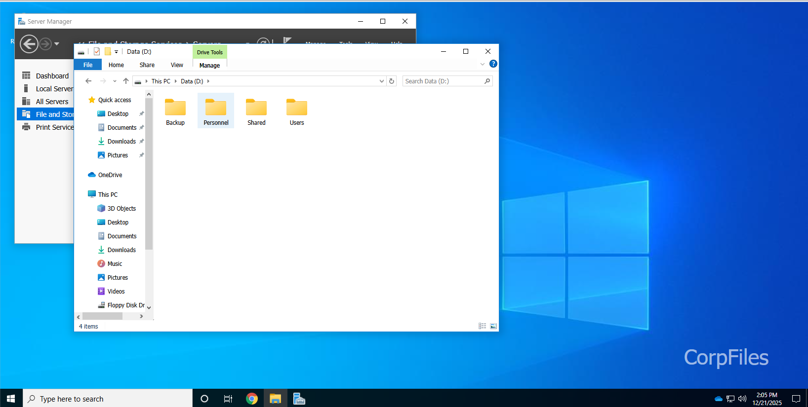
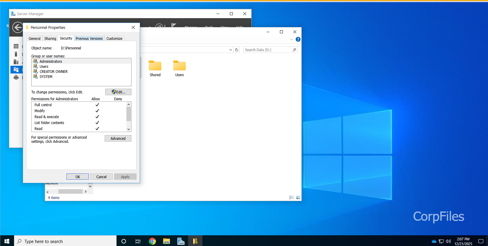
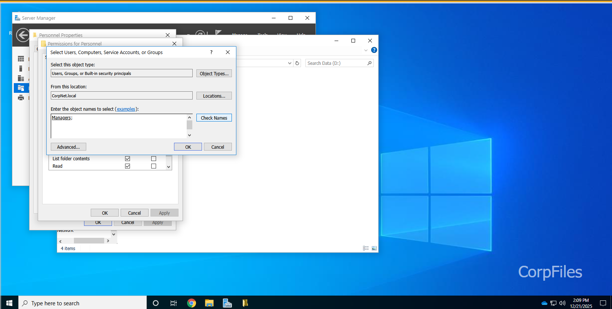
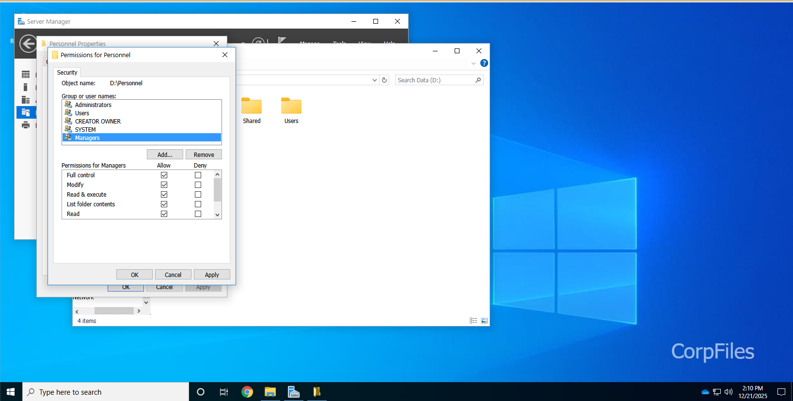
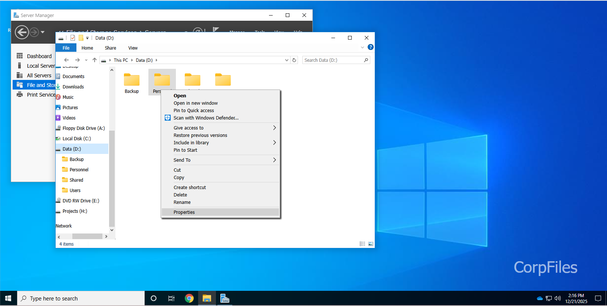
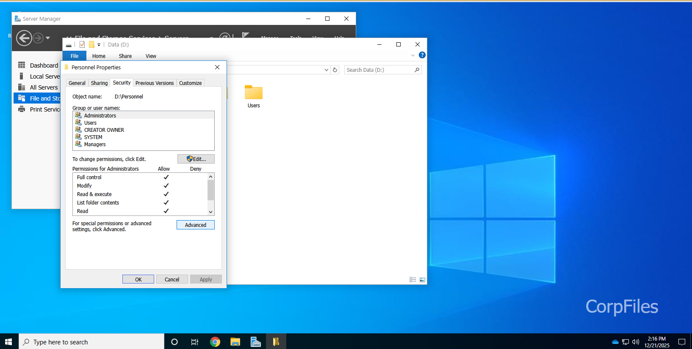
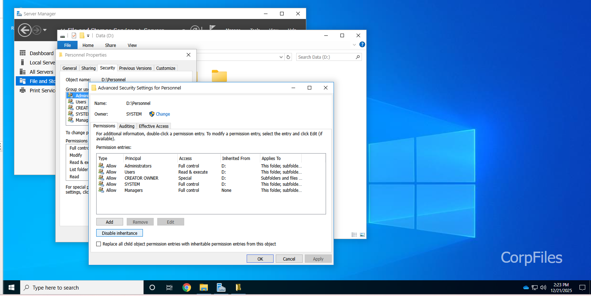
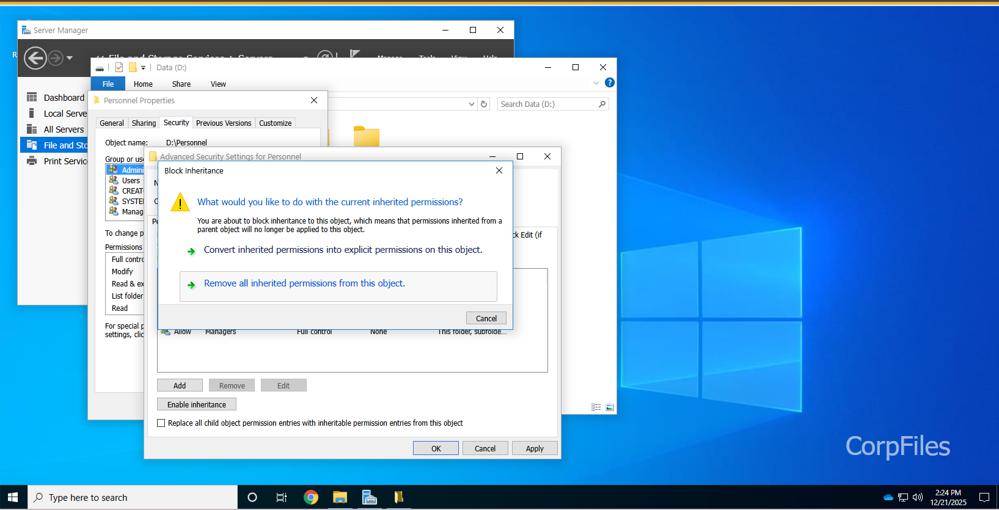
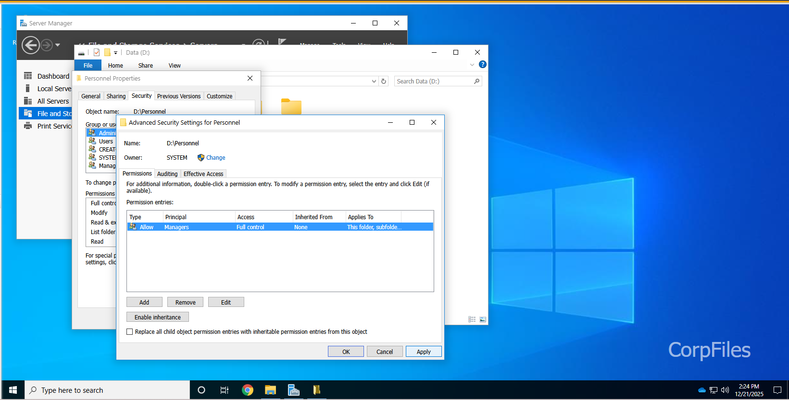

# 🔐 Lab : Disable Inheritance & NTFS Permission

---

## 📌 โจทย์ (Scenario)

ข้อมูลบุคลากรที่เป็น **ความลับ** ถูกจัดเก็บไว้บนไฟล์เซิร์ฟเวอร์ **CorpFiles**  
ภายในโฟลเดอร์ที่ใช้ร่วมกันชื่อว่า **Personnel**

🎯 **เป้าหมายของ LAB นี้**
- กำหนดสิทธิ์แบบ **NTFS**
- ให้ **เฉพาะกลุ่ม Managers เท่านั้น** ที่สามารถเข้าถึงข้อมูลได้
- ป้องกันไม่ให้รับสิทธิ์มาจากโฟลเดอร์แม่ (Drive D:)

---

## 🛠️ ขั้นตอนที่ 1 : กำหนดสิทธิ์ Full Control ให้กลุ่ม Managers

### 1️⃣ เปิด File Explorer

---

### 2️⃣ ไปที่ไดรฟ์ `D:`  
คลิกขวาที่โฟลเดอร์ **Personnel** ➜ เลือก **Properties**

---

### 3️⃣ ไปที่แท็บ **Security**  
คลิกปุ่ม **Edit**

---

### 4️⃣ คลิกปุ่ม **Add**

---

### 5️⃣ เพิ่มกลุ่ม Managers
- พิมพ์ชื่อกลุ่ม: `Managers`
- คลิก **Check Names**
- คลิก **OK**

---

### 6️⃣ กำหนดสิทธิ์
- เลือกกลุ่ม **Managers**
- ติ๊ก ☑️ **Allow – Full control**

---

### 7️⃣ บันทึกการตั้งค่า
คลิก **Apply ➜ OK ➜ OK**

---

## 🔥 ขั้นตอนที่ 2 : Remove Inherited Permissions

> ⚠️ ขั้นตอนนี้สำคัญมาก  
> ถ้าไม่ทำ → โฟลเดอร์ยังคงรับสิทธิ์จาก Drive D:

---

### 1️⃣ เปิด Properties ของโฟลเดอร์ Personnel
`D:\Personnel` ➜ คลิกขวา ➜ **Properties**

---

### 2️⃣ ไปที่แท็บ **Security**  
คลิกปุ่ม **Advanced**

---

### 3️⃣ ตรวจสอบสถานะ Inheritance
ด้านบนจะเห็นปุ่ม:

📌 แปลว่า: **ขณะนี้โฟลเดอร์ยังรับสิทธิ์จากโฟลเดอร์แม่อยู่**

👉 คลิก **Disable inheritance**

---

### 4️⃣ เลือกตัวเลือก
ในหน้าต่างที่ปรากฏ ให้เลือก:

🗑️ **Remove all inherited permissions from this object**

---

### 5️⃣ บันทึกการเปลี่ยนแปลง
คลิก **Apply ➜ OK ➜ OK**

---

## 🔍 วิธีตรวจสอบว่าไม่รับสิทธิ์จากโฟลเดอร์แม่แล้ว

### เส้นทางตรวจสอบ

