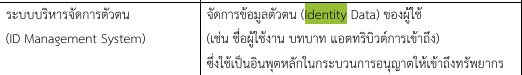
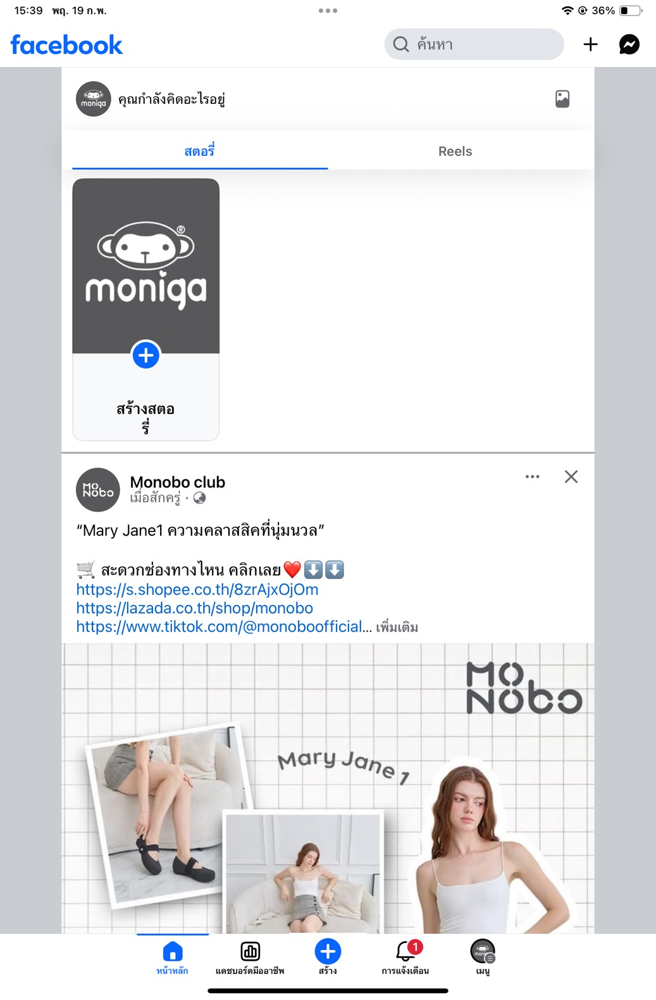
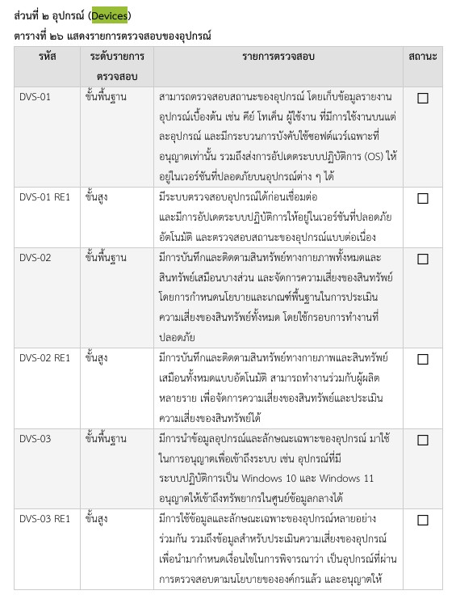
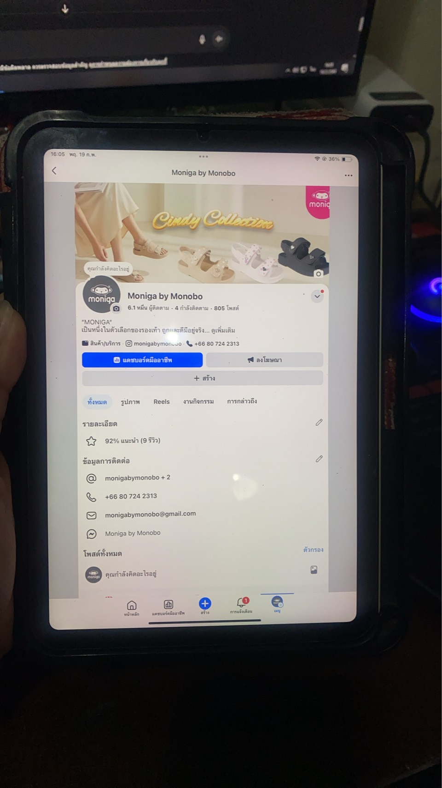
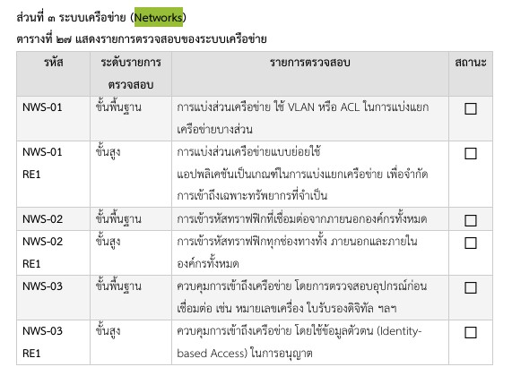
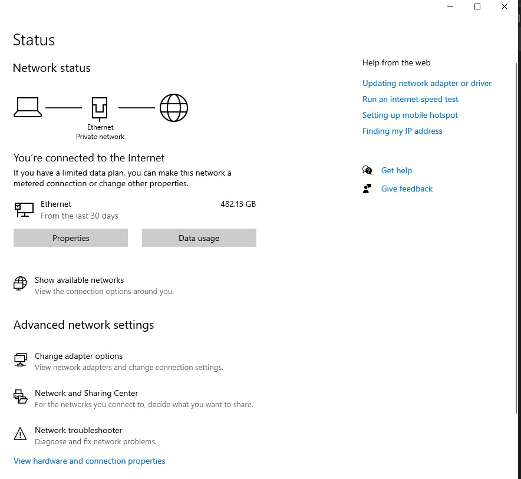
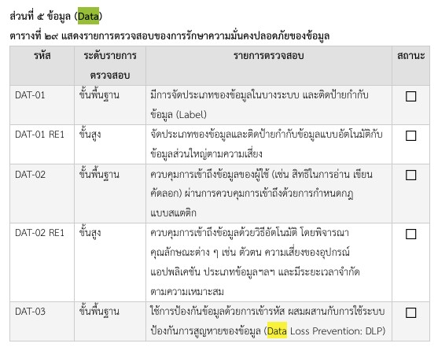
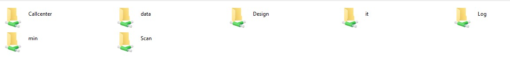
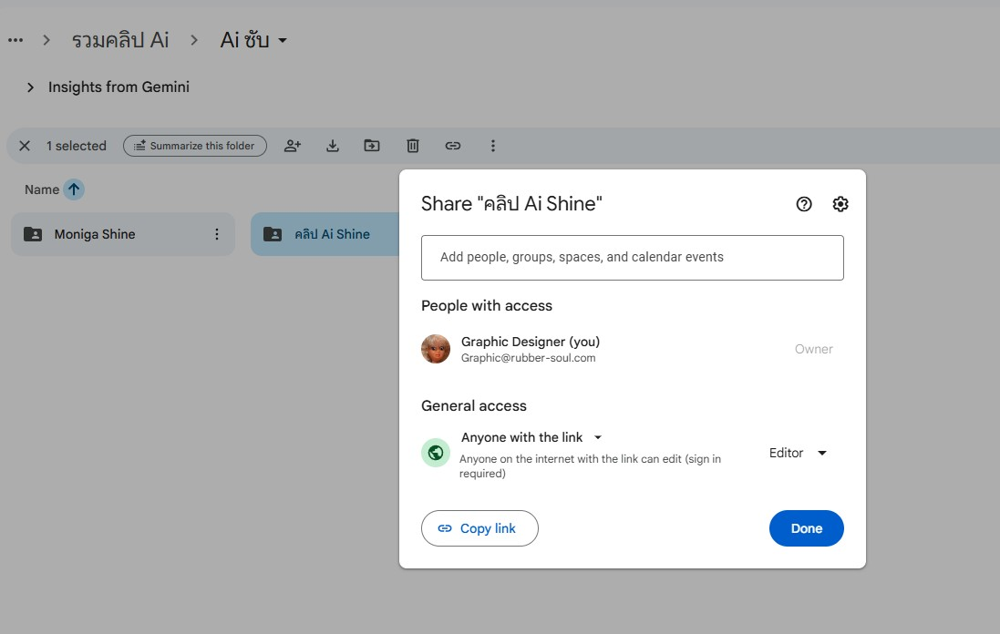

จากเนื้อหาในไฟล์ Zero Trust Guidelines ที่เจอคำที่เกี่ยวข้องกับ “ชีวิตประจำวัน”
(ในบริบทการใช้งานจริงของคนทั่วไป เช่น ใช้อุปกรณ์ เข้าระบบ ทำงานออนไลน์) สิ่งที่หนูเจอได้แก่

----

 ## 1.Identity
 
 
 
ตัวอย่างที่หนูใช้ในชีวิตประจำวันคือหมายถึงข้อมูลที่ใช้ระบุตัวผู้ใช้หรืออุปกรณ์
ในชีวิตประจำวัน:ล็อกอิน Facebook / LINE / Email
ใช้ Face ID หรือสแกนนิ้วปลดล็อกมือถือ
กรอก Username / Password (ของบริษัท)
# รูปตัวอย่างการใช้ Facebook ของเพจบริษัทค่ะ

 

----

 ## 2.Devices
 
  
  
ตัวอย่างที่หนูใช้ในชีวิตประจำวันคือในไฟล์:อุปกรณ์ที่เข้าถึงระบบ เช่น คอมพิวเตอร์ มือถือ
ในชีวิตประจำวัน: มือถือส่วนตัว แล็ปท็อปที่ทำงาน แท็บเล็ต เวลาเข้า Gmail 
จากมือถือกับจากคอม ระบบจะรู้ว่าเป็นคนเดียวกัน แต่ “อุปกรณ์ต่างกัน”
# รูปตัวอย่างการใช้อุปกรณ์ที่เข้าถึงระบบของบริษํทค่ะ

 
 

----

 ## 3.Networks
 
  
  
ตัวอย่างที่หนูใช้ในชีวิตประจำวันคือการเชื่อมต่อ เช่น อินเทอร์เน็ตหรือเครือข่ายองค์กร
ในชีวิตประจำวัน: Wi-Fi บริษัท
# รูปตัวอย่างการใช้อินเทอร์เน็ตหรือเครือข่ายองค์กร

----

 ## 4.Data
 
 
 
ตัวอย่างที่หนูใช้ในชีวิตประจำวันคือการป้องปกข้อมูลของบรฺิษัท แผนกหนูจะมี Data เฉพาะแผนกจะต้องมีรหัสถึงจะเข้าได้ค่ะ
# รูปตัวอย่างข้อมูลที่ต้องปกป้องในชีวิตประจำวัน

 

----

 ## 5.Access
 
  
  
  ตัวอย่างที่หนูใช้ในชีวิตประจำวันคือหนูจะมีลิงค์ Google Drive ส่งให้ซัพข้างนอกจะเป็นแบบไม่สามารถแก้ไขได้
  จะดูได้แค่อย่างเดียวค่ะ
# รูปตัวอย่างเข้าถึงทรัพยากรในชีวิตประจำวันของหนูคือ การแชร์ Google Drive

  

 
