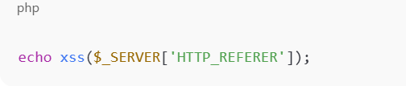
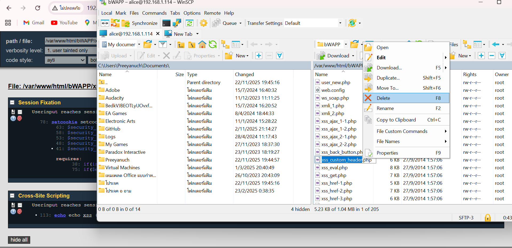
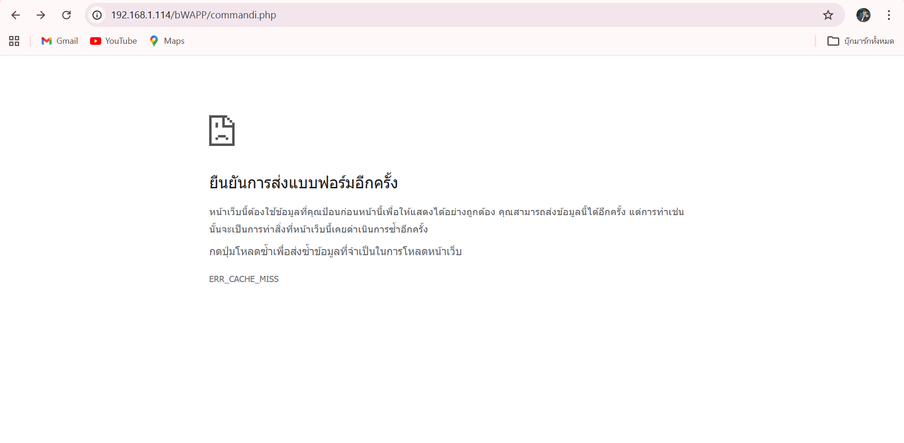

ปัญหาที่พบคือ ช่องโหว่ Cross-Site Scripting (XSS) แบบ Reflected
สาเหตุเกิดจากระบบนำข้อมูลที่ผู้ใช้สามารถควบคุมได้ (HTTP_REFERER) ไปแสดงผลบนหน้าเว็บโดยตรง ทำให้ข้อมูลดังกล่าวสามารถถูกดัดแปลงให้แทรกโค้ด JavaScript อันตรายได้
ช่องโหว่นี้อาจทำให้ผู้โจมตีสามารถรันสคริปต์ในเบราว์เซอร์ของผู้ใช้งาน ส่งผลให้เกิดการขโมยคุกกี้ ขโมยเซสชัน เปลี่ยนหน้าเว็บ หรือหลอกลวงผู้ใช้ (phishing)
สรุปคือ ระบบมีการนำข้อมูลจากภายนอกมาแสดงผลโดยไม่มีการป้องกันที่เพียงพอ ทำให้เกิดช่องโหว่ด้านความปลอดภัยประเภท Cross-Site Scripting (XSS)

ขั้นตอนการแก้ไข
ปัญหาที่พบเจอ

เปิด WinSCP

เมื่อทำการเชื่อมต่อเข้าสู่เซิร์ฟเวอร์ผ่านโปรแกรม WinSCP แล้วเข้าไปยังโฟลเดอร์ของเว็บไซต์ จากนั้นเปิดไฟล์เพื่อตรวจสอบโค้ดและเปรียบเทียบกับผลการสแกนจาก RIPS จะพบว่าบรรทัดที่ถูกแจ้งเตือนไม่ได้ถูกคอมเมนต์ไว้ แสดงว่าเป็นโค้ดที่ยังทำงานอยู่จริง โดยในกรณีนี้ไฟล์ที่เกี่ยวข้องคือ xss_back_button.php จึงต้องเข้าไปตรวจสอบและแก้ไขในไฟล์ดังกล่าวโดยตรง

เปิดไฟล์ผ่าน Visual Studio Code ขึ้นมาเพื่อหาช่องโหว่
เมื่อเปิดไฟล์ใน  Visual Studio Code จะได้หาช่องโหว่และแก้ไขปัญหาได้อย่างสะดวก

การแก้ไขช่องโหว่ที่พบเจอ

ปัญหาคือ $_SERVER['HTTP_REFERER'] เป็น ข้อมูลที่ผู้ใช้ควบคุมได้ (user input)
ถ้านำมาแสดงผลโดยไม่กรองให้ปลอดภัย อาจถูกโจมตีแบบ XSS ได้

ก่อนแก้

หลังแก้

จุดเปลี่ยนแปลงสำคัญ
1.มีการปรับแก้จุดที่นำข้อมูลจากภายนอกมาแสดงผลบนหน้าเว็บ
2.เพิ่มการป้องกันโดยเข้ารหัสข้อมูลก่อนนำไปแสดงผล (ป้องกันการรันสคริปต์อันตราย)
3.ลดความเสี่ยงจากการฝังโค้ด JavaScript ในส่วนของการแสดงผลหน้าเว็บ
4.ปรับรูปแบบการเรียกใช้งานข้อมูลให้ปลอดภัยมากขึ้น
5.หลังแก้ไขแล้วทำการสแกนซ้ำ พบว่าความเสี่ยงลดลงจากเดิม

เมื่อแก้ไขเสร็จ ให้ลบไฟล์เดิมทิ้ง

จากนั้นเมื่อลบไฟล์เก่าเสร็จ ให้นำไฟล์ใหม่ที่แก้แล้วมาแทนที่

ทดสอบการแก้ไข 
ปัญหาคือไม่สามารถกดปุ่ม Go Black
ผลการทดสอบ
ก่อนแก้ไข ไม่สามารถกดปุ่ม Go Black ได้

หลังแก้ไขเสร็จแล้วสามารถกดปุ่ม Go Black ได้ย้อนไปหน้า commandi.php ได้

จากการตรวจสอบและแก้ไขโค้ดในไฟล์ที่เกี่ยวข้อง ได้มีการปรับปรุงจุดที่รับข้อมูลจากภายนอกและนำไปแสดงผล โดยเพิ่มการป้องกันที่เหมาะสมก่อนการแสดงผลข้อมูล ทำให้ไม่สามารถแทรกหรือรันโค้ดอันตรายในเบราว์เซอร์ได้อีกต่อไป
หลังจากดำเนินการแก้ไขแล้ว ได้ทำการสแกนซ้ำด้วยเครื่องมือ RIPS เพื่อตรวจสอบความถูกต้อง พบว่าช่องโหว่ที่เกี่ยวข้องได้รับการแก้ไขเรียบร้อยแล้ว และความเสี่ยงด้าน Cross-Site Scripting (XSS) ถูกลดลงอย่างมีประสิทธิภาพ
ดังนั้น ระบบมีความปลอดภัยมากขึ้น และสามารถป้องกันการโจมตีในลักษณะดังกล่าวได้แล้วในจุดที่แก้ไขไว้
