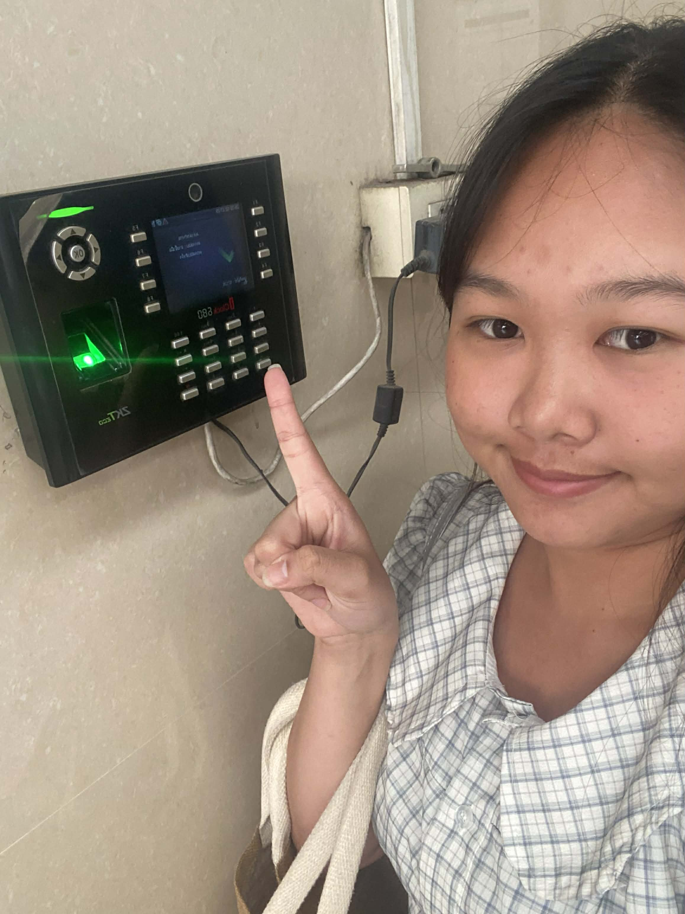

ระบบสแกนนิ้ว (Fingerprint Scanner)
เป็น Technical Security Control ที่มีลักษณะเป็น Preventive Control (การควบคุมเชิงป้องกัน)

เหตุผลคือ...

ควบคุมการเข้าถึง (Access Control) อนุญาตเฉพาะผู้ที่มีข้อมูลลายนิ้วมือในระบบ

ป้องกันการแอบอ้างตัวตน เพราะลายนิ้วมือเป็นข้อมูลชีวมิติที่เฉพาะบุคคล

ลดความเสี่ยงจากการใช้รหัสผ่านร่วมกัน

ป้องกันก่อนเกิดเหตุ โดยไม่อนุญาตให้ผู้ไม่มีสิทธิ์เข้าใช้งานระบบหรือพื้นที่

